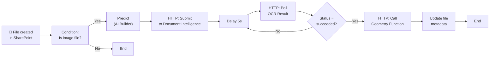

# Deployment Guide: Extract Text from Objects

> Companion deployment document for the [Extract Text from Objects](../services/ai-ml/extract-object-text.md) architecture.
> Use this guide to provision, configure, and validate the full solution.

## Table of Contents

1. [Resource Provisioning](#resource-provisioning)
2. [Azure Function Deployment](#azure-function-deployment)
3. [AI Builder Model Training](#ai-builder-model-training)
4. [Power Automate Flow Configuration](#power-automate-flow-configuration)
5. [SharePoint Configuration](#sharepoint-configuration)
6. [PnP Modern Search Setup](#pnp-modern-search-setup)
7. [Validation](#validation)
8. [Runbook](#runbook)

---

## Resource Provisioning

### Azure Resources (Bicep)

```bicep
// deploy/main.bicep
@description('The Azure region for deployment')
param location string = 'eastus'

@description('Environment name (dev, test, prod)')
param environmentName string = 'dev'

@description('Name of the Azure Function App')
param functionAppName string = 'func-geometry-${environmentName}'

@description('Name of the Storage Account for the function')
@minLength(3)
@maxLength(24)
param storageAccountName string = 'stgeomatch${environmentName}'

@description('Name of the Document Intelligence account')
param documentIntelligenceName string = 'acct-docintel-${environmentName}'

@description('Name of the Application Insights resource')
param appInsightsName string = 'appi-geometry-${environmentName}'

// ---- Document Intelligence ----
resource documentIntelligence 'Microsoft.CognitiveServices/accounts@2023-05-01' = {
  name: documentIntelligenceName
  location: location
  kind: 'FormRecognizer'
  sku: {
    name: 'S0'
  }
  properties: {
    customSubDomainName: documentIntelligenceName
  }
}

// ---- Application Insights ----
resource appInsights 'Microsoft.Insights/components@2020-02-02' = {
  name: appInsightsName
  location: location
  kind: 'web'
  properties: {
    Application_Type: 'web'
    WorkspaceResourceId: logAnalyticsWorkspace.id
  }
}

resource logAnalyticsWorkspace 'Microsoft.OperationalInsights/workspaces@2022-10-01' = {
  name: 'log-${environmentName}'
  location: location
  properties: {
    sku: { name: 'PerGB2018' }
  }
}

// ---- Storage Account ----
resource storageAccount 'Microsoft.Storage/storageAccounts@2023-01-01' = {
  name: storageAccountName
  location: location
  kind: 'StorageV2'
  sku: {
    name: 'Standard_LRS'
  }
}

// ---- Function App ----
resource functionApp 'Microsoft.Web/sites@2023-01-01' = {
  name: functionAppName
  location: location
  kind: 'functionapp'
  properties: {
    serverFarmId: hostingPlan.id
    siteConfig: {
      appSettings: [
        { name: 'FUNCTIONS_EXTENSION_VERSION', value: '~4' }
        { name: 'FUNCTIONS_WORKER_RUNTIME', value: 'node' }
        { name: 'AzureWebJobsStorage', value: storageAccount.properties.primaryEndpoints.blob }
        { name: 'APPLICATIONINSIGHTS_CONNECTION_STRING', value: appInsights.properties.ConnectionString }
        { name: 'DOCUMENT_INTELLIGENCE_ENDPOINT', value: documentIntelligence.properties.endpoint }
      ]
    }
  }
}

resource hostingPlan 'Microsoft.Web/serverFarms@2022-09-01' = {
  name: 'plan-geometry-${environmentName}'
  location: location
  kind: 'functionapp'
  sku: {
    name: 'Y1'
    tier: 'Dynamic'
  }
}

// ---- Outputs ----
output functionEndpoint string = functionApp.properties.defaultHostName
output documentIntelligenceEndpoint string = documentIntelligence.properties.endpoint
output appInsightsConnectionString string = appInsights.properties.ConnectionString
```

### Deploy with Azure CLI

```bash
# Deploy the Bicep template
az deployment sub create \
  --location eastus \
  --template-file deploy/main.bicep \
  --parameters environmentName=dev

# Or deploy at resource group scope
az group create --name rg-extract-object-text-dev --location eastus
az deployment group create \
  --resource-group rg-extract-object-text-dev \
  --template-file deploy/main.bicep \
  --parameters environmentName=dev
```

---

## Azure Function Deployment

### Local Setup

```bash
# 1. Create the function project
mkdir geometry-match-function && cd geometry-match-function
func init --typescript

# 2. Add the HTTP-triggered function
func new --name matchText --template "HTTP trigger" --authlevel "function"

# 3. Install dependencies
npm install

# 4. Copy the implementation from the main document
# (see "Code: Azure Function for Geometry Matching" in extract-object-text.md)

# 5. Build
npm run build

# 6. Run locally
func start
```

### Test Locally

```bash
# In another terminal, test with curl
curl -X POST http://localhost:7071/api/matchText \
  -H "Content-Type: application/json" \
  -d '{
    "objects": {
      "prediction": {
        "result": [
          { "box": { "l": 100, "t": 100, "w": 200, "h": 100 }, "tag": "component", "confidence": 0.95 }
        ]
      }
    },
    "ocrResult": {
      "analyzeResult": {
        "pages": [
          {
            "lines": [
              {
                "text": "PART-123",
                "words": [{ "text": "PART-123", "boundingBox": [120,130,180,130,180,150,120,150], "confidence": 0.99 }],
                "boundingBox": [120,130,180,130,180,150,120,150]
              }
            ]
          }
        ]
      }
    }
  }'

# Expected response:
# {
#   "matchedObjects": [
#     { "id": "obj-1", "type": "component", "confidence": 0.95,
#       "boundingBox": { "x": 100, "y": 100, "width": 200, "height": 100 },
#       "matchedText": ["PART-123"] }
#   ],
#   "totalObjects": 1,
#   "totalWords": 1,
#   "matchedWords": 1
# }
```

### Publish to Azure

```bash
# 1. Build
npm run build

# 2. Publish
func azure functionapp publish func-geometry-dev

# 3. Verify
curl -X POST https://func-geometry-dev.azurewebsites.net/api/matchText \
  -H "Content-Type: application/json" \
  -H "x-functions-key: YOUR_FUNCTION_KEY" \
  -d '{"objects":{"prediction":{"result":[]}},"ocrResult":{"analyzeResult":{"pages":[]}}}'
```

---

## AI Builder Model Training

### Data Preparation

1. **Collect images**: Gather 50-100 images per object type you want to detect
2. **Annotate**: Use [Azure AI Custom Vision](https://www.customvision.ai/) or the AI Builder labeling interface
3. **Format**: Supported formats: PNG, JPEG, BMP, GIF (non-animated)
4. **Quality guidelines**:
   - Minimum resolution: 320×320 pixels
   - Maximum resolution: 8000×8000 pixels
   - Objects should occupy at least 5% of the image area

### Training Steps

```text
1. Navigate to: https://make.powerapps.com → AI Builder → Models
2. Click "Build a model" → "Object detection"
3. Name your model: "Engineering Object Detector"
4. Upload training images (use the "Add images" button)
5. For each image:
   a. Click "Add tag" and enter object type (e.g., "valve", "callout", "component")
   b. Draw bounding box around each object instance
   c. Assign the tag
6. Click "Train" to start training
7. Review precision, recall, and average precision (AP) metrics
   - Target: >80% precision and recall
   - If below target: add more images, re-annotate ambiguous boxes
8. Publish the model
```

### Testing the Model

```text
1. In AI Builder model details, click "Quick test"
2. Upload a test image not used in training
3. Verify detected objects and confidence scores
4. Accept if confidence > 0.8 for correct detections
```

---

## Power Automate Flow Configuration

### Flow Overview



### Detailed Action Configuration

**Trigger:** When a file is created in a folder

| Field | Value |
| --- | --- |
| Site Address | `https://{tenant}.sharepoint.com/sites/Engineering` |
| Folder ID | `/Shared Documents/Schematics` |

**Action 1:** Condition (file type filter)

```text
Left: @triggerOutputs()?['body/extension']
Operation: ends with
Right: 'png'
OR
Left: @triggerOutputs()?['body/extension']
Operation: ends with
Right: 'jpg'
OR
Left: @triggerOutputs()?['body/extension']
Operation: ends with
Right: 'jpeg'
OR
Left: @triggerOutputs()?['body/extension']
Operation: ends with
Right: 'tiff'
OR
Left: @triggerOutputs()?['body/extension']
Operation: ends with
Right: 'bmp'
```

**Action 2:** Apply AI Builder model (in the "Yes" branch)

| Field | Value |
| --- | --- |
| Operation | Predict |
| Model | Your published object detection model |
| Image | File content (from trigger) |

**Action 3:** Submit to Document Intelligence

```text
Operation: HTTP
Method: POST
URI: https://{your-endpoint}.cognitiveservices.azure.com/formrecognizer/documentModels/prebuilt-read:2023-07-31/analyze?api-version=2023-07-31
Headers:
  Content-Type: application/json
  Ocp-Apim-Subscription-Key: @{secretUri('https://{vault}.vault.azure.net/secrets/docintel-key')}
Body:
  {
    "urlSource": "@{triggerOutputs()?['body/absoluteUrl']}"
  }
```

**Action 4:** Parse Operation-Location header

```text
Operation: Initialize variable
Name: varOperationLocation
Type: String
Value: @{outputs('HTTP')?['headers/Operation-Location']}
```

**Action 5:** Delay

```text
Operation: Delay
Count: 5
Unit: Second
```

**Action 6:** Poll OCR Result

```text
Operation: HTTP
Method: GET
URI: @{variables('varOperationLocation')}
Headers:
  Ocp-Apim-Subscription-Key: @{secretUri('https://{vault}.vault.azure.net/secrets/docintel-key')}
```

**Action 7:** Condition (check status)

```text
Left: @{outputs('Poll_OCR')?['body/status']}
Operation: is equal to
Right: 'succeeded'
```

If no → Go back to Delay (Action 5), max 10 retries

**Action 8:** Call Geometry Function

```text
Operation: HTTP
Method: POST
URI: https://func-geometry-dev.azurewebsites.net/api/matchText
Headers:
  Content-Type: application/json
  x-functions-key: @{secretUri('https://{vault}.vault.azure.net/secrets/function-key')}
Body:
  {
    "objects": @{body('Predict')},
    "ocrResult": @{body('Poll_OCR')}
  }
```

**Action 9:** Update file metadata

```text
Operation: Update file property (SharePoint)
Site Address: https://{tenant}.sharepoint.com/sites/Engineering
File Identifier: @{triggerOutputs()?['body/id']}
Properties:
  ExtractedText: @{outputs('Geometry_Function')?['body/matchedText']}
  ObjectTypes: @{join(outputs('Geometry_Function')?['body/matchedObjects']?['type'], ';')}
  ProcessingDate: @{utcNow()}
  ProcessingStatus: 'Completed'
```

---

## SharePoint Configuration

### Create Metadata Columns

```powershell
# PowerShell (PnP PowerShell module)
Connect-PnPOnline -Url "https://{tenant}.sharepoint.com/sites/Engineering"

# Add site columns
Add-PnPField -DisplayName "Extracted Text" -InternalName "ExtractedText" `
  -Type Note -Group "AI Extraction" -Required:$false

Add-PnPField -DisplayName "Object Types" -InternalName "ObjectTypes" `
  -Type Text -Group "AI Extraction" -Required:$false

Add-PnPField -DisplayName "Processing Date" -InternalName "ProcessingDate" `
  -Type DateTime -Group "AI Extraction" -Required:$false

Add-PnPField -DisplayName "Processing Status" -InternalName "ProcessingStatus" `
  -Type Choice -Group "AI Extraction" -Required:$false -Choices @("Pending","Processing","Completed","Failed")

# Add columns to document library
Add-PnPFieldToDocumentLibrary -List "Schematics" -Field "ExtractedText"
Add-PnPFieldToDocumentLibrary -List "Schematics" -Field "ObjectTypes"
Add-PnPFieldToDocumentLibrary -List "Schematics" -Field "ProcessingDate"
Add-PnPFieldToDocumentLibrary -List "Schematics" -Field "ProcessingStatus"
```

### Enable Metadata for Search

1. Go to SharePoint Admin Center → Search → Managed Properties
2. Verify that `ExtractedText` and `ObjectTypes` are mapped to crawled properties
3. If not visible, trigger a full crawl:
   ```powershell
   # PowerShell
   Request-PnPSearchCrawl -Type Full -Url "https://{tenant}.sharepoint.com/sites/Engineering"
   ```

---

## PnP Modern Search Setup

### Installation

```bash
# Download from: https://github.com/microsoft-search/pnp-modern-search/releases
# Upload to SharePoint App Catalog

# Or use CLI for Microsoft 365
m365 spo app add --filePath ./pnp-modern-search.sppkg --overwrite
m365 spo app deploy --name pnp-modern-search.sppkg
```

### Configuration

1. Edit a SharePoint page → add **Search Box** web part
2. Add **Search Results** web part below it
3. Configure Search Results:

```json
{
  "queryTemplate": "{searchTerms} path:\"/sites/Engineering/Shared Documents/Schematics\"",
  "sorting": {
    "sortBy": [{ "property": "ProcessingDate", "direction": "Descending" }]
  },
  "refiners": [
    {
      "property": "ObjectTypes",
      "displayName": "Object Type",
      "template": "Checkbox"
    },
    {
      "property": "ProcessingDate",
      "displayName": "Processing Date",
      "template": "DateRange"
    }
  ],
  "resultTypes": [
    {
      "property": "ProcessingStatus",
      "value": "Completed",
      "icon": "CheckMark"
    }
  ]
}
```

---

## Validation

### Test Matrix

| Test Case | Input | Expected Result | Pass Criteria |
| --- | --- | --- | --- |
| Basic extraction | Image with one object containing text | Text matched to object | `ExtractedText` populated in SharePoint |
| Multiple objects | Image with 3+ objects | Each object has correct text | `ObjectTypes` shows all types |
| No objects | Image with no detectable objects | Empty result, no metadata written | Flow completes, no metadata update |
| Unsupported file | .pdf, .docx | Flow exits without processing | Condition skips, flow shows "Skipped" |
| Large image | 4000×4000 px | Document processed within 60s | Flow completes < 90s |

### Validation Script

```powershell
# Validate-Extraction.ps1
param(
  [string]$SiteUrl = "https://{tenant}.sharepoint.com/sites/Engineering",
  [string]$LibraryName = "Schematics"
)

Connect-PnPOnline -Url $SiteUrl

$items = Get-PnPListItem -List $LibraryName -PageSize 10
$processed = 0
$failed = 0

foreach ($item in $items) {
  $status = $item["ProcessingStatus"]
  $text = $item["ExtractedText"]
  
  if ($status -eq "Completed" -and $text) {
    Write-Host "✅ $($item.FileLeafRef): ${text}..." -ForegroundColor Green
    $processed++
  } elseif ($status -eq "Failed") {
    Write-Host "❌ $($item.FileLeafRef): Failed" -ForegroundColor Red
    $failed++
  }
}

Write-Host "`nSummary:" -ForegroundColor Cyan
Write-Host "  Processed: $processed"
Write-Host "  Failed: $failed"
Write-Host "  Total: $($items.Count)"
```

---

## Runbook

### Daily Operations

```text
1. Monitor Power Automate flow run history
   - URL: https://make.powerapps.com → Flows → Run history
   - Check for failed runs and error messages

2. Check Azure Function health
   - URL: https://portal.azure.com → Function App → Monitor
   - Verify no 500 errors, average duration < 500ms

3. Review Document Intelligence usage
   - URL: https://portal.azure.com → Document Intelligence → Metrics
   - Check pages processed vs. quota
```

### Incident Response

| Incident | Symptoms | Response |
| --- | --- | --- |
| Flow failures | Run history shows failed | Check error message. Common: Document Intelligence key expired, function key rotated |
| No metadata written | Flow succeeds but metadata empty | Check Function logs in Application Insights. Test function directly with curl |
| Poor detection accuracy | Wrong objects detected | Retrain AI Builder model with more annotated images |
| Throttling | HTTP 429 errors | Reduce concurrency in Power Automate, request quota increase for Document Intelligence |
| Search not returning results | Metadata exists but search empty | Trigger full crawl in SharePoint Admin Center |

### Monthly Maintenance

- [ ] Review AI Builder model accuracy metrics
- [ ] Rotate Document Intelligence keys (if not using managed identity)
- [ ] Check Power Automate license consumption
- [ ] Review Application Insights for performance trends
- [ ] Update document library metadata schema if needed

### Quarterly

- [ ] Retrain AI Builder model with new document samples
- [ ] Review and update the Well-Architected review
- [ ] Cost optimization review (right-size Document Intelligence tier)
- [ ] Security audit (managed identity usage, Key Vault access)

---

## Troubleshooting

### Common Issues

| Issue | Root Cause | Resolution |
| --- | --- | --- |
| `403 Forbidden` from Document Intelligence | Key expired or wrong region | Regenerate key in Azure Portal, update Power Automate connection |
| `429 Too Many Requests` | Exceeded Document Intelligence TPS limit | Add retry policy with exponential backoff in Power Automate |
| Function returns `500` | Invalid input format | Check that `objects` and `ocrResult` have expected JSON structure |
| Metadata not searchable | SharePoint hasn't crawled yet | Trigger full crawl or wait 15-30 minutes for incremental crawl |
| AI Builder model returns empty | Model not published or wrong input format | Verify model is published, check image format is supported |

### Logs and Diagnostics

```bash
# Query Application Insights for function errors
az monitor app-insights query \
  --app appi-geometry-dev \
  --analytics-query "requests | where success == false | project timestamp, name, resultCode, duration" \
  --offset 24h

# Check function live metrics
az monitor app-insights query \
  --app appi-geometry-dev \
  --analytics-query "traces | order by timestamp desc | take 20"
```
