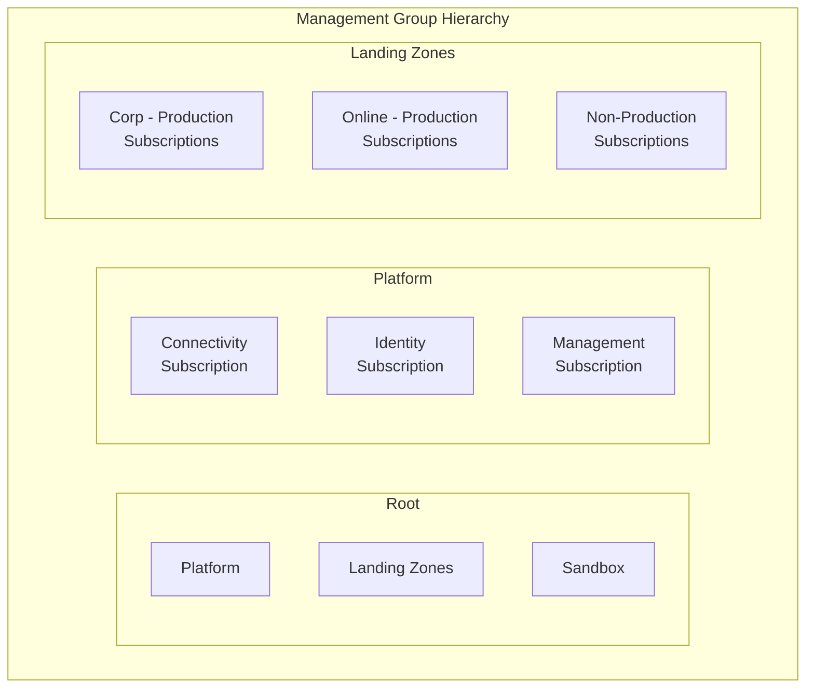
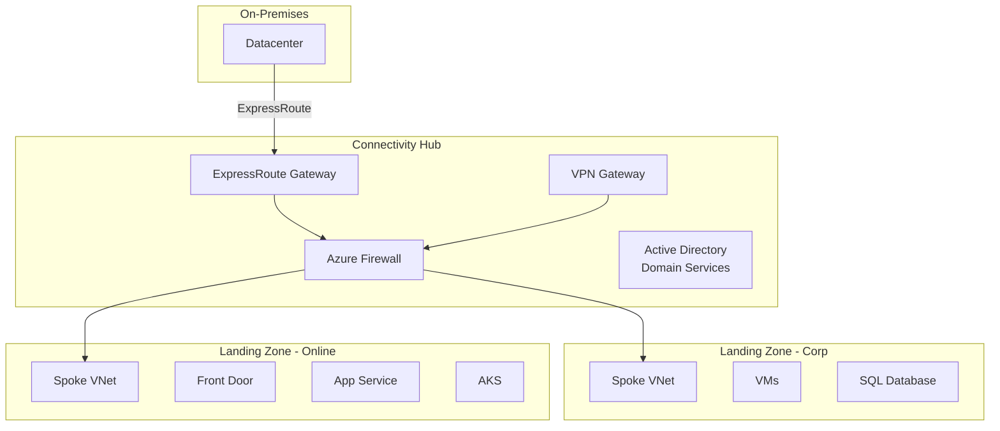

# Azure Landing Zones

## What it is

An Azure Landing Zone is the foundation infrastructure for cloud adoption at
scale — the subscription architecture, governance, networking, identity, and
security baseline that every workload deploys onto.

## Architecture components

| Layer | Azure Service | Purpose |
| --- | --- | --- |
| **Identity** | Entra ID, PIM, Conditional Access | Centralized identity and access |
| **Connectivity** | Hub VNet, Azure Firewall, ExpressRoute, VPN | Network hub for all landing zones |
| **Management** | Log Analytics, Automation Account, Backup Vault | Monitoring, patching, backup |
| **Governance** | Azure Policy, RBAC, Blueprints, Defender | Guardrails and compliance |

## Enterprise-scale landing zone

## Deployment options

| Approach | Tooling | When to use |
| --- | --- | --- |
| Azure Portal Quick Start | Portal wizard | First-time, simple setup |
| ARM/Bicep templates | Infrastructure as Code | Customization needed |
| Terraform modules | HashiCorp Terraform | Multi-cloud existing TF |
| Azure CLI / PowerShell | Scripted automation | Automated pipelines |

## Decision: Hub-spoke vs. Virtual WAN

| Factor | Hub-spoke | Virtual WAN |
| --- | --- | --- |
| Complexity | Moderate | Higher (managed) |
| Control | Full control over hub | Microsoft-managed |
| Scale | 100s of spokes | 1000s of spokes |
| Global routing | Manual | Automatic |
| Cost | Predictable | Higher at small scale |

## Related terms

- [Network Topologies](network-topologies.md)
- [Identity Architecture](identity-architecture.md)
- [Azure Policy and Governance](../../docs/concepts/governance.md)
- [Glossary: Hub-spoke](../../docs/glossary/README.md#hub-spoke)
