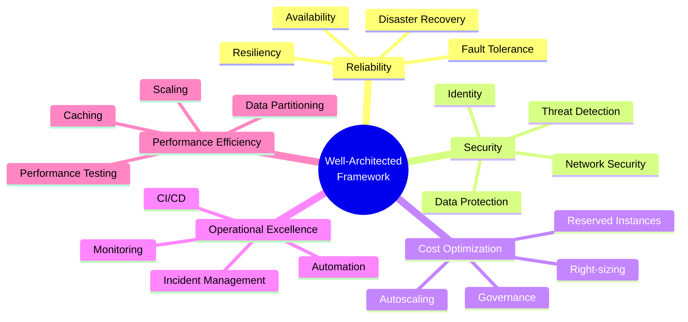

# Azure Well-Architected Framework

## Overview

The Microsoft Azure Well-Architected Framework is a set of guiding tenets that
help you build high-quality, reliable, and secure cloud workloads. It consists
of **five pillars of architectural excellence** and the **Azure Well-Architected
Review** assessment.

## The five pillars

### 1. Reliability

The ability of a system to recover from failures and continue to function.

| Pattern | Azure Service | Description |
| --- | --- | --- |
| Availability Zones | VMs, AKS, SQL DB | Distribute across physically separate zones |
| Geo-redundancy | Cosmos DB, SQL DB, Storage | Replicate across paired regions |
| Load balancing | Front Door, Traffic Manager, ALB | Distribute traffic and failover |
| Circuit breaker | App Service + Health checks | Stop sending requests to failing instances |
| Bulkhead | AKS node pools | Isolate workloads to limit blast radius |

### 2. Security

Protecting applications and data from threats.

| Capability | Azure Service |
| --- | --- |
| Identity | Entra ID, Managed Identities, Conditional Access |
| Secrets | Key Vault |
| Network security | NSG, ASG, Azure Firewall, WAF |
| Threat detection | Defender for Cloud, Sentinel |
| Data encryption | Storage Service Encryption, SQL TDE, Always Encrypted |

### 3. Cost Optimization

Managing and reducing costs without sacrificing performance.

| Strategy | Azure Tool |
| --- | --- |
| Right-sizing | Azure Advisor |
| Reserved capacity | Reserved Instances, Savings Plans |
| Autoscaling | VMSS, App Service Autoscale |
| Governance | Azure Policy, Budgets, Cost Management |

### 4. Operational Excellence

Operations processes that keep a system running in production.

| Practice | Azure Tooling |
| --- | --- |
| Infrastructure as Code | Bicep, ARM, Terraform |
| CI/CD | Azure DevOps, GitHub Actions |
| Monitoring | Azure Monitor, Application Insights |
| Incident response | Azure Monitor Alerts, Automation Runbooks |

### 5. Performance Efficiency

The ability to adapt to changes in load.

| Pattern | Azure Service |
| --- | --- |
| Horizontal scaling | VMSS, AKS, App Service |
| Caching | Azure Cache for Redis, CDN, Front Door |
| Data partitioning | Cosmos DB partitions, SQL sharding |
| Content delivery | Azure CDN, Front Door |

## Azure Well-Architected Review

A systematic evaluation of your workload against the five pillars:

1. **Assess** — answer the Well-Architected Review questionnaire
2. **Identify** — find high-priority recommendations
3. **Remediate** — apply the recommended improvements
4. **Track** — monitor progress over time

The review is available through:
- **[Azure Well-Architected Review](https://learn.microsoft.com/en-us/assessments/?mode=assessment&assessment=azure-well-architected&id=azure-well-architected)** — self-service assessment
- **Azure Advisor** — personalized recommendations
- **Microsoft Partner-led** — paid assessments

## Related terms

- [Regions and Availability Zones](regions-and-azs.md)
- [Azure Resource Manager](azure-resource-manager.md)
- [Glossary: CAP Theorem](../glossary/README.md#cap-theorem)
- [Glossary: SLA](../glossary/README.md#sla)
