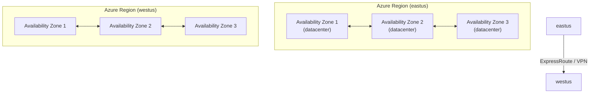
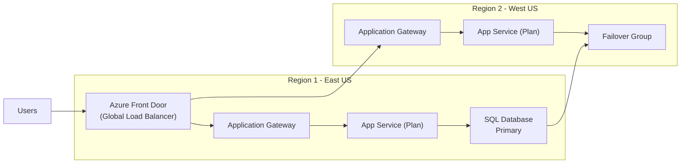

# Azure Regions and Availability Zones

## What it is

Azure Regions are geographic areas that contain one or more datacenters connected
through a dedicated regional low-latency network. Availability Zones (AZs) are
physically separate locations within an Azure region, each with independent power,
cooling, and networking.

## Key facts

- **160+** Azure Regions worldwide (most of any cloud provider)
- **3 Availability Zones** per supported region (minimum)
- **Paired regions** for geo-redundancy (e.g., East US × West US)
- **Region pairs** are at least 300 miles apart (in the US)
- **Some services** are zone-redundant by default (AKS, Cosmos DB)
- **Some services** require explicit zone configuration (VMs, managed disks)

## Service categories by availability

| Category | Behavior | Examples |
| --- | --- | --- |
| Zonal | Deployed to a specific zone, survive other zones | VMs, Disks, IP addresses |
| Zone-redundant | Replicated across zones automatically | Cosmos DB, Event Hubs, AKS |
| Regional | No zone awareness, survives region-level failure | App Service, Functions, SQL Database |
| Global | Spans multiple regions globally | Traffic Manager, Front Door, DNS |

## Diagram: Multi-region active-active architecture

## Choosing regions

1. **Proximity to users** — lowest latency for your audience
2. **Service availability** — not all services are in all regions
3. **Zone support** — some regions have 3 AZs, some have none
4. **Compliance and data residency** — sovereign regions, data boundaries
5. **Cost** — pricing varies by region

## Related terms

- [Resource Hierarchy](resource-hierarchy.md)
- [Azure Resource Manager](azure-resource-manager.md)
- [Glossary: Geo-redundancy](../glossary/README.md#geo-redundancy)
