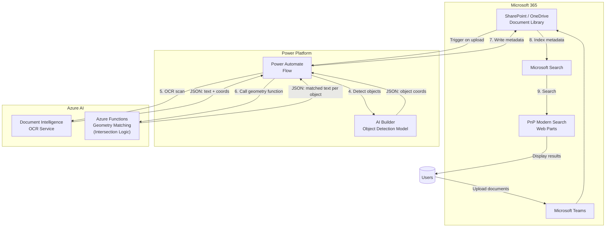
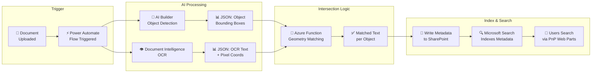
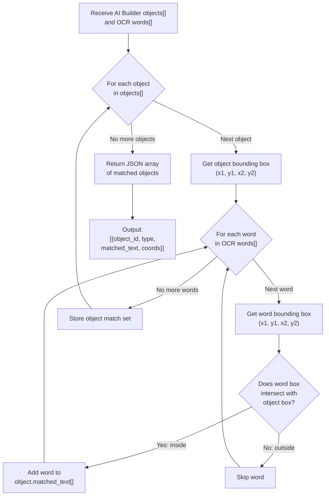
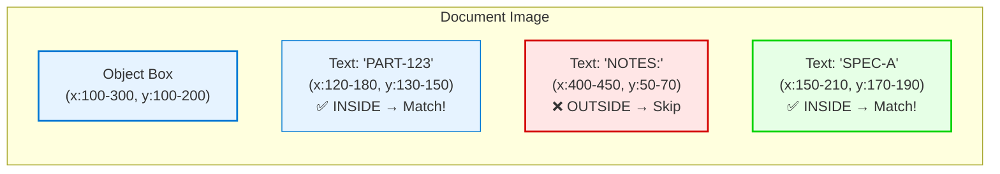
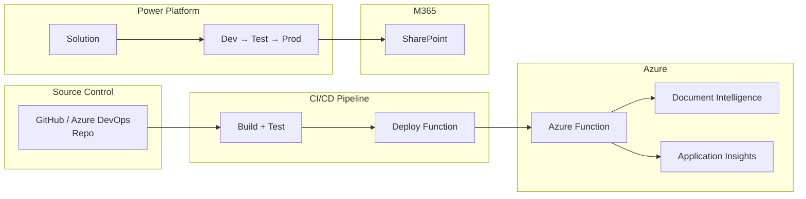

# Extract Text from Objects Using AI Builder and Document Intelligence

> **Production-ready architecture guide**  
> Turn scanned engineering schematics, industrial diagrams, and architectural drawings
> into searchable documents by extracting text embedded inside specific objects.

## Table of Contents

1. [Overview](#overview)
2. [Architecture](#architecture)
3. [Visual Flow Diagram](#visual-flow-diagram)
4. [Component Breakdown](#component-breakdown)
5. [Prerequisites](#prerequisites)
6. [Step-by-Step Implementation](#step-by-step-implementation)
7. [Code: Azure Function for Geometry Matching](#code-azure-function-for-geometry-matching)
8. [Deployment Guide](#deployment-guide)
9. [Well-Architected Considerations](#well-architected-considerations)
10. [Cost Estimation](#cost-estimation)
11. [Alternatives](#alternatives)
12. [Next Steps](#next-steps)

---

## Overview

### Problem

Engineering schematics, industrial diagrams, and architectural drawings contain
critical text — part numbers, valve labels, room codes — embedded inside visual
objects (boxes, callouts, symbols). Standard OCR extracts *all* text from a
document but cannot tell you which text belongs to which object. Manual scanning
is slow and error-prone.

### Solution

Combine **AI Builder object detection** with **Azure Document Intelligence OCR**
and a geometry-matching **Azure Function**. The pipeline:

1. Detects objects of interest in an image (AI Builder)
2. Extracts *all* text with pixel coordinates (Document Intelligence)
3. Matches text to the object it falls inside (Azure Function)
4. Writes matched metadata back to the source document
5. Makes it searchable via Microsoft Search

### Use Cases

| Domain | Example | Value |
| --- | --- | --- |
| **Engineering** | Find every part number in a PCB schematic | Part shortage analysis, recall tracking |
| **Industrial** | Locate all pressure valves in a plant diagram | Preventive maintenance, hazard isolation |
| **Architecture** | Search for room codes across a floor plan set | Asset location, space management |
| **Facilities** | Identify HVAC equipment labels in building drawings | Maintenance scheduling |

---

## Architecture



### Data Flow

```
User uploads document
       │
       ▼
┌──────────────────┐
│ SharePoint/      │  Trigger: When a file is created
│ OneDrive Library │  in a folder
└────────┬─────────┘
         │
         ▼
┌──────────────────┐     ┌──────────────────────┐
│   AI Builder     │────►│ Bounding boxes of    │
│ Object Detection │     │ detected objects     │
│                  │     │ (JSON with pixel     │
│                  │     │  coordinates)        │
└──────────────────┘     └──────────────────────┘
         │
         ▼
┌──────────────────┐     ┌──────────────────────┐
│ Document         │────►│ Full OCR output      │
│ Intelligence OCR │     │ with pixel coords    │
│                  │     │ for every word/line  │
└──────────────────┘     └──────────────────────┘
         │
         ▼
┌──────────────────────────────────────────────┐
│         Azure Function (Geometry Match)       │
│                                              │
│  For each detected object:                   │
│    For each OCR text block:                  │
│      if text block INSIDE object bounding    │
│      box → associate text with that object   │
│                                              │
│  Returns: [{ object, matched_text, coords }] │
└──────────────────┬───────────────────────────┘
                   │
                   ▼
┌──────────────────┐
│ Power Automate   │  Writes matched text as
│ writes metadata  │  SharePoint document
│ back to document │  metadata columns
└──────────────────┘
                   │
                   ▼
┌──────────────────┐
│ Microsoft Search │  Indexes the new metadata
│ indexes metadata │  → discoverable in M365
└──────────────────┘
```

---

## Visual Flow Diagram

### High-Level Process



### Geometry Intersection Logic



### Intersection Test (Visual)



---

## Component Breakdown

### Microsoft Power Platform

| Component | Role | Details |
| --- | --- | --- |
| **AI Builder** | Object detection | Train a custom model to recognize objects (valves, callouts, component boxes). Returns JSON with bounding box coordinates. |
| **Power Automate** | Orchestration | Triggered by file upload, coordinates calls to AI Builder, Document Intelligence, and Azure Function. Writes results back to SharePoint metadata. |

### Azure

| Service | Role | SKU / Plan | Details |
| --- | --- | --- | --- |
| **Document Intelligence** | Full-page OCR | S0 tier (pay per page) | Extracts all text with pixel coordinates. Use Read OCR API for printed text. |
| **Azure Functions** | Geometry matching | Consumption plan | HTTP-triggered function that compares bounding boxes and returns intersecting text. |

### Microsoft 365

| Component | Role |
| --- | --- |
| **SharePoint / OneDrive** | Document source and metadata target |
| **Microsoft Teams** | Alternative upload channel |
| **Microsoft Search** | Indexes extracted metadata for cross-M365 search |
| **PnP Modern Search** | Open-source SharePoint web parts for custom search UX |

---

## Prerequisites

### Azure Subscription

- An active Azure subscription
- Contributor access to create:
  - Azure Document Intelligence resource
  - Azure Function App (Consumption plan)
  - Application Insights (optional but recommended)

### Power Platform

- Power Automate Premium license (per-user or per-flow)
- AI Builder credits or add-on capacity
- Power Platform environment with Dataverse enabled

### Microsoft 365

- SharePoint Online with document libraries
- Microsoft Search enabled
- Permissions to create/manage SharePoint metadata columns

### Development Tools

- [Node.js 18+](https://nodejs.org/) or [.NET 8 SDK](https://dotnet.microsoft.com/download) (for Azure Function)
- [Azure Functions Core Tools](https://learn.microsoft.com/en-us/azure/azure-functions/functions-run-local)
- [Azure CLI](https://learn.microsoft.com/en-us/cli/azure/install-azure-cli)
- [Power Platform CLI](https://learn.microsoft.com/en-us/power-platform/developer/cli/introduction) (for ALM)

---

## Step-by-Step Implementation

### Step 1: Train the AI Builder Object Detection Model

1. Sign in to [Power Apps](https://make.powerapps.com) and navigate to your environment.
2. Go to **AI Builder** → **Models** → **Build a model**.
3. Choose **Object Detection** as the model type.
4. Upload training images that contain the objects you want to detect.
5. Draw bounding boxes around each object in your training images:
   - Tag each object type (e.g., `valve`, `callout`, `component`, `revision-block`)
   - Provide at least 15 images per tag for good accuracy
6. Train the model and review the performance metrics.
7. Publish the model.

> **Best Practice:** Use at least 50 images per tag for production quality. Include
> variations in scale, rotation, and lighting. Review the precision/recall scores
> and retrain if below 80%.

### Step 2: Create the Azure Document Intelligence Resource

```bash
# Create resource group
az group create --name rg-doc-intelligence --location eastus

# Create Document Intelligence resource (S0 tier)
az cognitiveservices account create \
  --name acct-docintel \
  --resource-group rg-doc-intelligence \
  --kind FormRecognizer \
  --sku S0 \
  --location eastus

# Get the endpoint and key
az cognitiveservices account show \
  --name acct-docintel \
  --resource-group rg-doc-intelligence \
  --query properties.endpoint

az cognitiveservices account keys list \
  --name acct-docintel \
  --resource-group rg-doc-intelligence \
  --query key1
```

### Step 3: Deploy the Geometry-Matching Azure Function

See the [Code: Azure Function for Geometry Matching](#code-azure-function-for-geometry-matching)
section below for the full implementation.

```bash
# Create function app
az functionapp create \
  --name func-geometry-match \
  --resource-group rg-doc-intelligence \
  --storage-account stgeofunc \
  --consumption-plan-location eastus \
  --runtime node \
  --functions-version 4

# Deploy from local directory
cd geometry-match-function
func azure functionapp publish func-geometry-match
```

### Step 4: Build the Power Automate Flow

Create a new **Automated cloud flow** with the SharePoint trigger:

**Trigger:** When a file is created in a folder (SharePoint)

```text
Site Address: https://yourtenant.sharepoint.com/sites/Engineering
Folder ID: /Shared Documents/Schematics
```

**Action 1:** Apply AI Builder object detection model

```text
Operation: Predict (AI Builder)
Model: Your published object detection model
Input: File content from trigger
```

**Action 2:** Call Document Intelligence OCR

```text
Operation: HTTP (or use Document Intelligence connector)
Method: POST
URI: https://{your-endpoint}/formrecognizer/documentModels/prebuilt-read:2023-07-31/analyze?api-version=2023-07-31
Headers:
  Content-Type: application/json
  Ocp-Apim-Subscription-Key: {your-key}
Body:
  {
    "urlSource": "{file-url-from-sharepoint}"
  }
```

**Action 3:** Poll for OCR result (after delay)

```text
Operation: HTTP
Method: GET
URI: {operation-location-from-headers}
Headers:
  Ocp-Apim-Subscription-Key: {your-key}
```

**Action 4:** Call geometry matching Azure Function

```text
Operation: HTTP
Method: POST
URI: https://func-geometry-match.azurewebsites.net/api/match-text
Headers:
  Content-Type: application/json
Body:
  {
    "objects": @{outputs('AI_Builder')?['body/prediction/result']},
    "ocrResult": @{outputs('Document_Intelligence')?['body/analyzeResult']}
  }
```

**Action 5:** Write metadata back to SharePoint

```text
Operation: Update file property (SharePoint)
Site Address: https://yourtenant.sharepoint.com/sites/Engineering
File Identifier: {file-id-from-trigger}
Properties:
  ExtractedText: @{outputs('Geometry_Function')?['body/matchedText']}
  ObjectTypes: @{outputs('Geometry_Function')?['body/objectTypes']}
```

### Step 5: Configure SharePoint Metadata Columns

1. Navigate to your SharePoint document library.
2. Add the following **site columns** (or library columns):

| Column Name | Type | Description |
| --- | --- | --- |
| `ExtractedText` | Multiple lines of text | All matched text concatenated |
| `ObjectTypes` | Choice (multi-select) | Types of objects detected |
| `ProcessingDate` | Date/Time | When the document was processed |
| `ProcessingStatus` | Choice | Pending, Processing, Completed, Failed |

3. Ensure these columns are indexed for search:
   - Go to Library Settings → Indexed Columns
   - Add `ExtractedText` and `ObjectTypes`

### Step 6: Configure PnP Modern Search Web Parts

1. Install [PnP Modern Search](https://microsoft-search.github.io/pnp-modern-search/) solution in your SharePoint tenant.
2. Add the Search Box and Search Results web parts to a SharePoint page.
3. Configure the Search Results web part to include custom refiners:
   - **Refiner:** `ObjectTypes` (choice)
   - **Refiner:** `ProcessingDate` (date range)
4. Create a Search Vertical for "Object Search":
   - Scope: specific document libraries
   - Result types: documents with `ExtractedText` populated

---

## Code: Azure Function for Geometry Matching

This is the core intersection logic that matches OCR text to detected objects.

### Node.js (TypeScript) Implementation

```typescript
// geometry-match-function/src/index.ts
import { app, HttpRequest, HttpResponseInit, InvocationContext } from '@azure/functions';

interface BoundingBox {
  x: number;
  y: number;
  width: number;
  height: number;
}

interface DetectedObject {
  id: string;
  type: string;
  confidence: number;
  boundingBox: BoundingBox;
  matchedText: string[];
}

interface OCRWord {
  text: string;
  boundingBox: number[];  // [x1, y1, x2, y2, x3, y3, x4, y4] polygon
  confidence: number;
}

interface OCRLine {
  text: string;
  words: OCRWord[];
  boundingBox: number[];
}

interface AIBuilderResult {
  prediction?: {
    result?: Array<{
      box: { l: number; t: number; w: number; h: number };
      tag: string;
      confidence: number;
    }>;
  };
}

interface DocumentIntelligenceResult {
  analyzeResult?: {
    pages?: Array<{
      lines?: OCRLine[];
    }>;
  };
}

interface MatchRequest {
  objects: AIBuilderResult;
  ocrResult: DocumentIntelligenceResult;
}

interface MatchResponse {
  matchedObjects: DetectedObject[];
  totalObjects: number;
  totalWords: number;
  matchedWords: number;
}

/**
 * Check if a point is inside a rectangle.
 */
function isPointInsideRect(
  px: number,
  py: number,
  rx: number,
  ry: number,
  rw: number,
  rh: number
): boolean {
  return px >= rx && px <= rx + rw && py >= ry && py <= ry + rh;
}

/**
 * Check if any corner of the word's bounding polygon
 * falls inside the object's bounding box.
 * Uses polygon format [x1,y1, x2,y2, x3,y3, x4,y4].
 */
function doesWordIntersectObject(
  wordPolygon: number[],
  objX: number,
  objY: number,
  objW: number,
  objH: number
): boolean {
  // Check all four corners
  for (let i = 0; i < 4; i++) {
    const px = wordPolygon[i * 2];
    const py = wordPolygon[i * 2 + 1];
    if (isPointInsideRect(px, py, objX, objY, objW, objH)) {
      return true;
    }
  }

  // Also check: is the entire object box inside this word?
  // (edge case for large text blocks)
  if (
    isPointInsideRect(objX, objY, wordPolygon[0], wordPolygon[1],
      wordPolygon[4] - wordPolygon[0], wordPolygon[5] - wordPolygon[3])
  ) {
    return true;
  }

  return false;
}

/**
 * Extract all words from the Document Intelligence result.
 */
function extractAllWords(ocrResult: DocumentIntelligenceResult): OCRWord[] {
  const words: OCRWord[] = [];
  for (const page of ocrResult.analyzeResult?.pages ?? []) {
    for (const line of page.lines ?? []) {
      for (const word of line.words ?? []) {
        words.push(word);
      }
    }
  }
  return words;
}

/**
 * Main geometry matching function.
 */
function matchTextToObjects(
  aiBuilderResult: AIBuilderResult,
  ocrResult: DocumentIntelligenceResult
): MatchResponse {
  const detectedObjects = aiBuilderResult.prediction?.result ?? [];
  const allWords = extractAllWords(ocrResult);

  const matchedObjects: DetectedObject[] = [];
  let matchedCount = 0;

  for (const obj of detectedObjects) {
    const objBbox = obj.box;
    const matchedText: string[] = [];

    for (const word of allWords) {
      if (doesWordIntersectObject(
        word.boundingBox,
        objBbox.l, objBbox.t, objBbox.w, objBbox.h
      )) {
        matchedText.push(word.text);
        matchedCount++;
      }
    }

    matchedObjects.push({
      id: `obj-${matchedObjects.length + 1}`,
      type: obj.tag,
      confidence: obj.confidence,
      boundingBox: {
        x: objBbox.l,
        y: objBbox.t,
        width: objBbox.w,
        height: objBbox.h
      },
      matchedText
    });
  }

  return {
    matchedObjects,
    totalObjects: detectedObjects.length,
    totalWords: allWords.length,
    matchedWords: matchedCount
  };
}

/**
 * HTTP-triggered Azure Function endpoint.
 * POST /api/match-text
 */
export async function matchTextHandler(
  request: HttpRequest,
  context: InvocationContext
): Promise<HttpResponseInit> {
  context.log('Processing geometry match request');

  try {
    const body = await request.json() as MatchRequest;

    if (!body.objects || !body.ocrResult) {
      return {
        status: 400,
        jsonBody: {
          error: 'Both "objects" and "ocrResult" fields are required.'
        }
      };
    }

    const result = matchTextToObjects(body.objects, body.ocrResult);

    context.log(
      `Matched ${result.matchedWords} words across ${result.totalObjects} objects`
    );

    return {
      status: 200,
      jsonBody: result
    };
  } catch (error) {
    context.error('Error processing geometry match:', error);
    return {
      status: 500,
      jsonBody: {
        error: 'Internal processing error',
        details: error instanceof Error ? error.message : 'Unknown error'
      }
    };
  }
}

// Register the function
app.http('matchText', {
  methods: ['POST'],
  authLevel: 'function',
  handler: matchTextHandler
});
```

### package.json

```json
{
  "name": "geometry-match-function",
  "version": "1.0.0",
  "description": "Azure Function for matching OCR text to detected objects",
  "main": "dist/src/index.js",
  "scripts": {
    "build": "tsc",
    "start": "func start",
    "test": "jest"
  },
  "dependencies": {
    "@azure/functions": "^4.0.0"
  },
  "devDependencies": {
    "@types/node": "^20.0.0",
    "typescript": "^5.3.0",
    "jest": "^29.0.0",
    "@types/jest": "^29.0.0",
    "ts-jest": "^29.0.0"
  }
}
```

### tsconfig.json

```json
{
  "compilerOptions": {
    "target": "ES2020",
    "module": "NodeNext",
    "moduleResolution": "NodeNext",
    "outDir": "dist",
    "rootDir": ".",
    "strict": true,
    "esModuleInterop": true,
    "skipLibCheck": true
  }
}
```

### Unit Tests

```typescript
// geometry-match-function/src/__tests__/geometry.test.ts
import { describe, it, expect } from '@jest/globals';

describe('Geometry Matching', () => {
  describe('isPointInsideRect', () => {
    it('should return true when point is inside rectangle', () => {
      // Using the internal logic via the exported function behavior
      const rect = { x: 100, y: 100, width: 200, height: 100 };
      const point = { x: 150, y: 130 };
      
      // Point (150,130) is inside (100,100)-(300,200)
      expect(point.x >= rect.x).toBe(true);
      expect(point.x <= rect.x + rect.width).toBe(true);
      expect(point.y >= rect.y).toBe(true);
      expect(point.y <= rect.y + rect.height).toBe(true);
    });

    it('should return false when point is outside rectangle', () => {
      const rect = { x: 100, y: 100, width: 200, height: 100 };
      const point = { x: 400, y: 500 };
      
      expect(point.x <= rect.x + rect.width).toBe(false);
    });
  });

  describe('matchTextToObjects', () => {
    const mockAIResult = {
      prediction: {
        result: [
          { box: { l: 100, t: 100, w: 200, h: 100 }, tag: 'component', confidence: 0.95 }
        ]
      }
    };

    const mockOCRResult = {
      analyzeResult: {
        pages: [
          {
            lines: [
              {
                text: 'PART-123',
                words: [
                  { text: 'PART-123', boundingBox: [120, 130, 180, 130, 180, 150, 120, 150], confidence: 0.99 }
                ],
                boundingBox: [120, 130, 180, 130, 180, 150, 120, 150]
              },
              {
                text: 'NOTES',
                words: [
                  { text: 'NOTES', boundingBox: [400, 50, 450, 50, 450, 70, 400, 70], confidence: 0.99 }
                ],
                boundingBox: [400, 50, 450, 50, 450, 70, 400, 70]
              }
            ]
          }
        ]
      }
    };

    it('should match text inside object bounding box', () => {
      const result = matchTextToObjects(mockAIResult, mockOCRResult);
      expect(result.matchedObjects).toHaveLength(1);
      expect(result.matchedObjects[0].matchedText).toContain('PART-123');
      expect(result.matchedObjects[0].matchedText).not.toContain('NOTES');
    });

    it('should report correct counts', () => {
      const result = matchTextToObjects(mockAIResult, mockOCRResult);
      expect(result.totalObjects).toBe(1);
      expect(result.totalWords).toBe(2);
      expect(result.matchedWords).toBe(1);
    });
  });
});
```

---

## Deployment Guide

### Deployment Architecture



### Prerequisites Checklist

- [ ] Azure subscription with Contributor access
- [ ] Power Automate Premium license
- [ ] AI Builder credits provisioned
- [ ] SharePoint Online site with document library
- [ ] Azure CLI installed (`az --version`)
- [ ] Azure Functions Core Tools installed (`func --version`)
- [ ] Node.js 18+ or .NET 8 SDK installed

### Azure Resource Deployment

Deploy all Azure resources using a Bicep template for repeatability:

```bicep
// deploy/main.bicep
param location string = 'eastus'
param environmentName string = 'dev'
param functionAppName string = 'func-geometry-match-${environmentName}'
param storageAccountName string = 'stgeomatch${environmentName}'
param documentIntelligenceName string = 'acct-docintel-${environmentName}'
param appInsightsName string = 'appi-geometry-${environmentName}'

resource rg 'Microsoft.Resources/resourceGroups@2023-07-01' = {
  name: 'rg-extract-object-text-${environmentName}'
  location: location
}

module documentIntelligence 'modules/document-intelligence.bicep' = {
  name: 'document-intelligence'
  scope: rg
  params: {
    name: documentIntelligenceName
    location: location
    sku: 'S0'
  }
}

module functionApp 'modules/function-app.bicep' = {
  name: 'function-app'
  scope: rg
  params: {
    name: functionAppName
    location: location
    storageAccountName: storageAccountName
    appInsightsName: appInsightsName
    documentIntelligenceEndpoint: documentIntelligence.outputs.endpoint
  }
}

output functionEndpoint string = functionApp.outputs.defaultHostname
```

### CI/CD Pipeline (GitHub Actions)

```yaml
# .github/workflows/deploy-function.yml
name: Deploy Geometry Match Function

on:
  push:
    branches: [main]
    paths:
      - 'geometry-match-function/**'

jobs:
  build-and-deploy:
    runs-on: ubuntu-latest
    steps:
      - uses: actions/checkout@v4
      
      - name: Setup Node.js
        uses: actions/setup-node@v4
        with:
          node-version: '20'
      
      - name: Install dependencies
        run: |
          cd geometry-match-function
          npm ci
      
      - name: Run tests
        run: |
          cd geometry-match-function
          npm test
      
      - name: Build
        run: |
          cd geometry-match-function
          npm run build
      
      - name: Deploy to Azure
        uses: Azure/functions-action@v1
        with:
          app-name: func-geometry-match
          package: geometry-match-function
          publish-profile: ${{ secrets.AZURE_FUNCTIONAPP_PUBLISH_PROFILE }}
```

### Power Platform ALM

1. Create a **Power Platform Solution**:
   - In Power Apps, navigate to Solutions → New Solution
   - Add: AI Builder model, Power Automate flow, custom connectors
   - Export as managed solution

2. **Environment Strategy**:

| Environment | Purpose | Data |
| --- | --- | --- |
| Dev | Build and test | Sample diagrams |
| Test | UAT validation | Real documents (copy) |
| Prod | Production | Real documents |

3. **Promote via Pipelines**:
   - Use [Power Platform Pipelines](https://learn.microsoft.com/en-us/power-platform/alm/pipelines)
   - Or deploy solutions manually through the admin center

### Post-Deployment Validation

After deployment, verify the pipeline with a test document:

1. Upload a test image containing objects with embedded text
2. Check Power Automate run history → should show "Succeeded"
3. Verify Azure Function logs in Application Insights
4. Check SharePoint document metadata → `ExtractedText` should be populated
5. Search for extracted text in SharePoint → should return the document

---

## Well-Architected Considerations

### Reliability

| Consideration | Implementation |
| --- | --- |
| **Transient failures** | Configure retry with exponential backoff on Document Intelligence HTTP action in Power Automate (max 3 retries, 5s interval) |
| **Idempotency** | Use SharePoint file ID as key; upsert metadata rather than append. Check `ProcessingStatus` before processing |
| **Long-running OCR** | Document Intelligence is async: submit → poll for result. Set a 5-minute timeout in Power Automate |
| **SLA targets** | Document Intelligence 99.9%, Functions 99.95%, Power Automate 99.9% |

### Security

| Consideration | Implementation |
| --- | --- |
| **Managed identity** | Configure Azure Function with system-assigned managed identity. Use Entra ID auth for Document Intelligence |
| **Secrets** | Store Document Intelligence key in Key Vault if Power Automate needs it. Use Key Vault connector to retrieve at runtime |
| **Document permissions** | SharePoint metadata inherits document permissions automatically |
| **Sensitive content** | OCR output may capture PII. Review your data classification policy before enabling broad scanning |

### Cost Optimization

| Item | Monthly Cost (est.) |
| --- | --- |
| **Document Intelligence S0** | ~$1.50 per 1,000 pages |
| **Azure Functions Consumption** | ~$0 (first 1M requests free) |
| **Power Automate Premium** | ~$15/user/month or ~$500/flow/month |
| **AI Builder credits** | ~$500/1M API calls (varies by plan) |

> **Cost saving tips:**
> - Use Power Automate conditions to skip non-image files
> - Downsample oversized images before processing to reduce Document Intelligence page count
> - Start with the Document Intelligence F0 tier (free, 500 pages/month) for development
> - Monitor AI Builder credit consumption in Power Platform admin center

### Performance Efficiency

| Consideration | Implementation |
| --- | --- |
| **Service limits** | Document Intelligence: 15 TPS (S0). AI Builder: varies by model type |
| **Parallel processing** | Power Automate triggers run concurrently by default — cap parallelism to stay within limits |
| **Image preprocessing** | Normalize orientation, crop whitespace, downsample images > 4K px before sending |
| **Cold starts** | Use Azure Functions Premium plan if <1s latency is required; Consumption plan has ~3-5s cold start |
| **High throughput** | Consider Logic Apps Standard for >100K documents/day |

### Operational Excellence

| Practice | Implementation |
| --- | --- |
| **ALM** | Package flow + AI Builder model in Power Platform Solution |
| **Source control** | Store Azure Function in GitHub/Azure DevOps with CI/CD |
| **Monitoring** | Application Insights (Function), Power Platform admin center (Flows), Azure Monitor (Document Intelligence) |
| **Model retraining** | Establish quarterly retraining cadence for AI Builder model. Track precision/recall drift |
| **Metadata schema versioning** | Version the metadata column schema so existing documents remain valid after schema changes |

---

## Cost Estimation

### Azure Services (per month)

| Service | SKU | Estimated Cost |
| --- | --- | --- |
| Document Intelligence | S0 ($0.0015/page) | $15.00 (10,000 pages) |
| Azure Functions | Consumption (1M exec) | $0.00 (within free grant) |
| Application Insights | Pay-as-you-go | ~$2.00 (1 GB data) |
| Storage Account | LRS (standard) | ~$1.00 |
| **Total Azure** | | **~$18.00/month** |

### Power Platform

| Item | Cost |
| --- | --- |
| Power Automate Premium (per-user) | $15/user/month |
| Power Automate Process (per-flow) | $500/flow/month |
| AI Builder credits | Included in Premium plans or add-on |

> Use the [preconfigured Azure pricing estimate](https://azure.com/e/97bc706f51b14769bc69f9084af3e2e8) for a detailed breakdown.

---

## Alternatives

| Alternative | When to Use | Trade-offs |
| --- | --- | --- |
| **Document Intelligence alone** | Don't need to scope OCR to specific objects | Simpler setup but no object-level filtering |
| **Azure Content Understanding** | Need LLM reasoning over documents (e.g., summarize revision notes, classify diagrams) | Higher cost, overkill for pure extraction |
| **Built-in SharePoint OCR** | Basic text extraction without object filtering | No object detection; extracts *all* text |
| **Azure Logic Apps (Standard)** | High-throughput scenarios (>100K docs/day) | Higher cost, more complex setup |

---

## Next Steps

1. **Train your AI Builder model** — this is the most critical step. Start with 30-50 annotated images per object type.
2. **Deploy the Azure Function** using the provided code and CI/CD pipeline.
3. **Build the Power Automate flow** following the step-by-step guide.
4. **Configure SharePoint metadata** and PnP Modern Search web parts.
5. **Test with real documents** and iterate on AI Builder model accuracy.
6. **Establish monitoring** with Application Insights dashboards and Power Platform analytics.

### Additional Resources

- [What is Azure Document Intelligence?](https://learn.microsoft.com/en-us/azure/ai-services/document-intelligence/overview)
- [AI Builder in Power Automate](https://learn.microsoft.com/en-us/ai-builder/use-in-flow-overview)
- [Document Intelligence custom models](https://learn.microsoft.com/en-us/azure/ai-services/document-intelligence/train/custom-model)
- [PnP Modern Search](https://microsoft-search.github.io/pnp-modern-search/)
- [Extract text from objects (Power Platform community blog)](https://community.powerplatform.com/blogs/post/?postid=7e80e9fc-2613-47b1-96f7-c4416624fc52)
