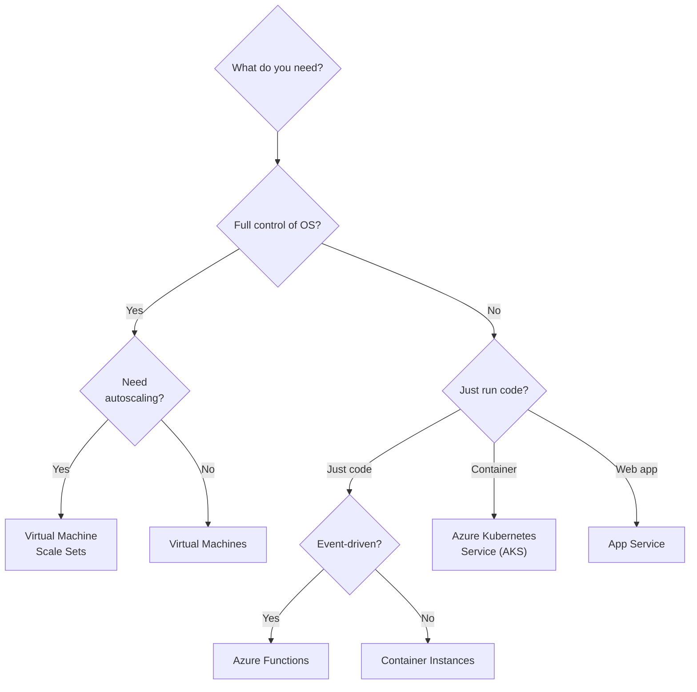

# Azure Compute

## Decision tree: Which compute service?

## Services

| Service | Best for | Management level | Scaling |
| --- | --- | --- | --- |
| **Virtual Machines** | Full OS control, legacy apps, custom software | IaaS | Manual / VMSS |
| **App Service** | Web apps, REST APIs, mobile backends | PaaS | Built-in auto |
| **Azure Functions** | Event-driven, short-running, serverless | Serverless | Auto (consumption) |
| **AKS** | Kubernetes orchestration, microservices | PaaS / Orchestrated | Cluster + HPA |
| **Container Instances** | Simple containers, batch jobs, CI runners | Serverless | Per-instance |
| **Container Apps** | Microservices, KEDA-driven event scaling | PaaS / Serverless | Auto + KEDA |
| **Azure Batch** | Large-scale parallel batch computing | Managed | Job-level |

## Service deep dives

- [Virtual Machines](virtual-machines.md)
- [App Service](app-service.md)
- [Azure Functions](functions.md)
- [Azure Kubernetes Service](aks.md)
