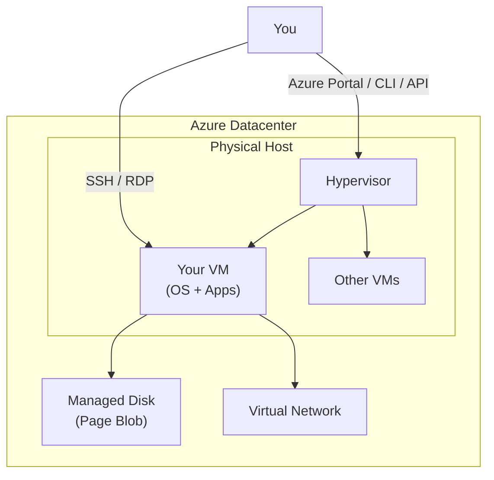

# Azure Virtual Machines

## What it is

Azure VMs provide infrastructure-as-a-service (IaaS) compute capacity. You get
full control over the operating system, software, and configuration while Azure
handles the physical hardware, hypervisor, and network fabric.

## How it works



## Key concepts

| Concept | Description |
| --- | --- |
| VM Size | CPU, memory, temporary storage (e.g., Standard_D2s_v3) |
| Series | Purpose-optimized families (General, Compute, Memory, GPU, etc.) |
| Availability Set | Logical grouping across fault/update domains (99.95% SLA) |
| Availability Zone | Physical separation across datacenters (99.99% SLA) |
| Managed Disk | Persistent block storage (Premium SSD, Standard SSD, Ultra) |
| VMSS | VM Scale Sets — identical VMs with autoscaling |

## VM series cheat sheet

| Series | Use case | CPU/Mem ratio |
| --- | --- | --- |
| **D** (General) | Dev/test, small DB, web | 1:4 |
| **E** (Memory-optimized) | Large DB, in-memory cache, analytics | 1:8 |
| **F** (Compute-optimized) | Batch, gaming, CI/CD agents | 1:2 |
| **NC/ND** (GPU) | ML training, rendering, HPC | Variable |
| **L** (Storage-optimized) | Big data, SQL/NoSQL, data warehousing | 1:4 |
| **B** (Burstable) | Low-usage variable workloads, dev/test | 1:4 |

## Step-by-step: Create a VM

```bash
# 1. Create resource group
az group create --name my-rg --location eastus

# 2. Create VM (Ubuntu)
az vm create \
  --resource-group my-rg \
  --name my-vm \
  --image Ubuntu2204 \
  --size Standard_D2s_v3 \
  --admin-username azureuser \
  --generate-ssh-keys

# 3. Open port 80
az vm open-port --port 80 --resource-group my-rg --name my-vm

# 4. SSH in
ssh azureuser@<public-ip>
```

## SLA and cost

| Configuration | Compute SLA |
| --- | --- |
| Single VM (Premium SSD) | 99.9% |
| 2+ VMs in Availability Set | 99.95% |
| 2+ VMs in Availability Zones | 99.99% |

**Cost factors:** VM size, OS license, managed disks, data egress, reserved vs pay-as-you-go.

## Related terms

- [Azure Regions and AZs](../../concepts/regions-and-azs.md)
- [Azure Networking](../../services/networking/README.md)
- [Glossary: IaaS](../../glossary/README.md#iaas)
- [Glossary: SLA](../../glossary/README.md#sla)
